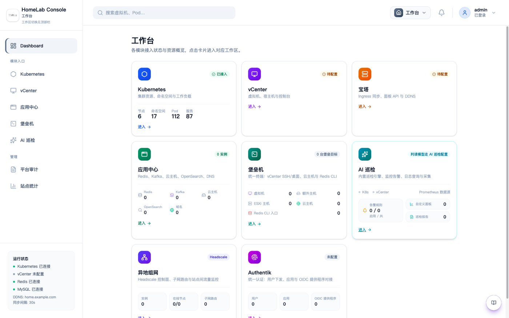
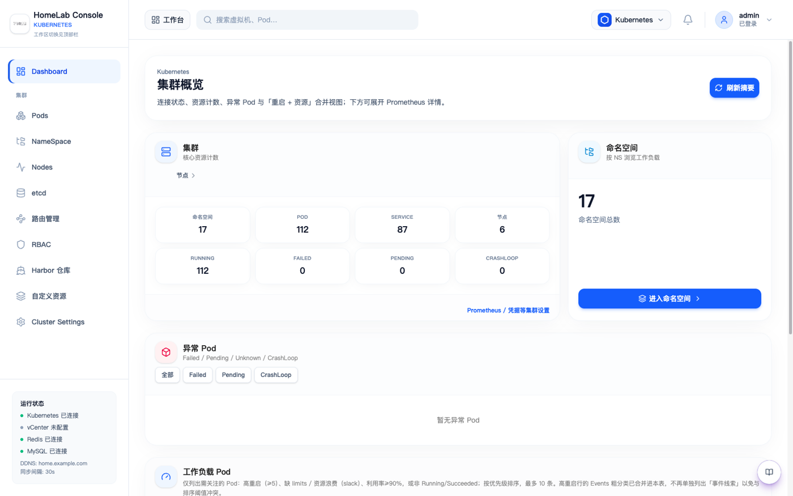
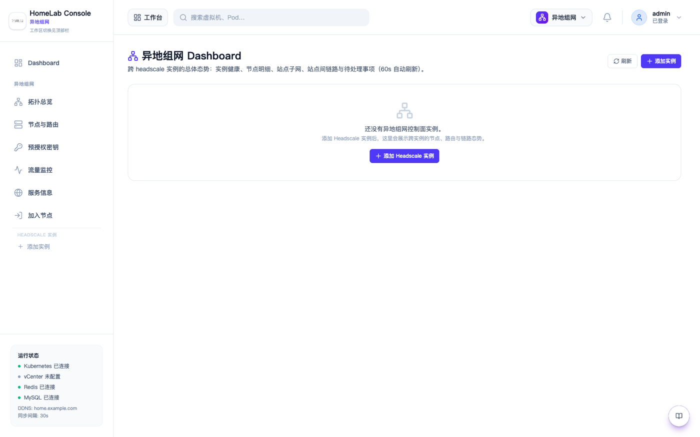
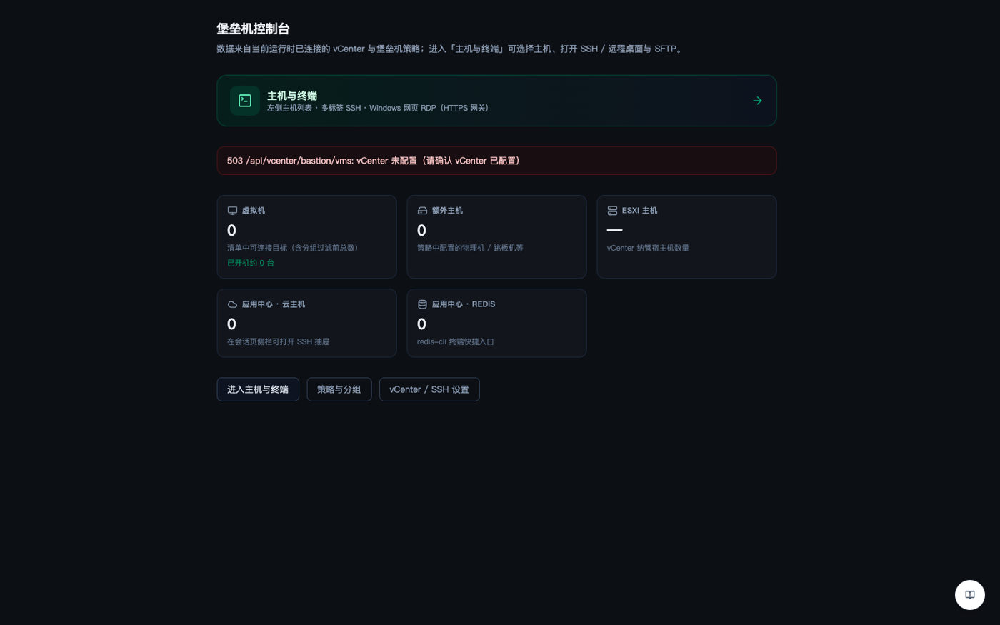

<div align="center">


# LabPlane

**面向 HomeLab 与自建集群的一体化运维控制台**

_Your HomeLab Control Plane_

[](https://github.com/abcdocker/labplane/actions/workflows/ci.yml)
[](https://go.dev/)
[](https://react.dev/)
[](LICENSE)

[中文](#功能概览) | [English](#overview)

**工作台总览** | **Kubernetes 集群** | **Headscale 异地组网** | **堡垒机**






</div>

---

## 功能概览

LabPlane 是一个面向 HomeLab 和自建 Kubernetes 集群的一体化运维平台，从 Ingress 自动发布到 Headscale 组网管理、Authentik SSO 用户治理，到 vCenter 控制台、堡垒机 SSH、AI 智能巡检——登录后按角色加载各模块。

### 🌐 异地组网（Headscale）

- 多实例 Headscale 控制面管理：节点、子网路由、预授权密钥
- Windows 一键加入工具（.bat + .ps1 + .json 自动打包下载）
- 默认可复用密钥（绑定 Authentik 用户，旧密钥自动过期）
- 重复节点自动检测与一键清理（保留最新在线）
- 站点间链路拓扑可视化（直连/DERP 中继 + 流量统计）
- 流量采集器服务发现（自动探测子网路由节点 SSH 可达性）
- 节点真实 LAN 地址展示（采集器回传）

### 🔐 Authentik SSO 用户治理

- 用户创建/管理、应用对接、OIDC 提供程序管理
- 事件审计日志
- 与 Headscale 组网联动（用户加入 Headscale 组即开通）

### ☸️ Kubernetes 集群管理

- 集群态 → 命名空间 → Pod 全链路资源管理
- Ingress / Gateway API 管理与自动发布
- Pod 终端（WebSocket SSH）、日志查看
- Deployment / StatefulSet / DaemonSet 滚动更新与回滚
- PVC / ConfigMap / Service 管理
- etcd 备份与恢复
- Pod 重启关联分析与报告

### 🖥️ 堡垒机

- 原生 SSH 终端（WebSocket）、SFTP 文件传输
- 会话审计录像与回放
- 主机凭据加密存储
- 多协议跳板（SSH / RDP / VNC）

### 🤖 AI 智能巡检

- 集群异常自动检测与报告
- 日志智能分析与告警
- 自然语言运维查询

### 🖥️ vCenter / 虚拟化

- 虚拟机列表、控制台、电源管理
- GPU 直通设备管理
- Cloud Host 统一管理

### 📊 监控与可观测

- Prometheus / VictoriaMetrics 集成
- Grafana 面板跳转
- 导出器指标可视化

---

## Overview

LabPlane is an all-in-one operations platform for HomeLab and self-hosted Kubernetes clusters. From automated Ingress publishing to Headscale mesh networking, Authentik SSO user governance, vCenter consoles, bastion SSH, and AI-powered inspection — modules are loaded by role after login.

### Key Features

| Module | Description |
|--------|-------------|
| **Mesh Networking** | Multi-instance Headscale management, Windows one-click join tool, reusable auth keys, duplicate node cleanup, traffic topology |
| **Authentik SSO** | User provisioning, app integration, OIDC provider management, event audit |
| **Kubernetes** | Full resource management, Ingress publishing, Pod terminal, etcd backup, restart analysis |
| **Bastion** | Native SSH terminal, SFTP, session recording, encrypted credentials |
| **AI Inspection** | Automated anomaly detection, log analysis, natural language queries |
| **vCenter** | VM list, console, power management, GPU passthrough |
| **Monitoring** | Prometheus / VictoriaMetrics integration, exporter dashboards |

---

## 🚀 Quick Start / 快速开始

### Prerequisites

- **MySQL 8.0+ 与 Redis 5+（必选）**：平台元数据存储与缓存/KV 双写，初始化向导（`/setup`）会校验两者连通性。
  没有现成实例？用仓库自带的一键环境（自动生成随机密码到 `.env`）：

  ```bash
  bash scripts/init-compose-env.sh   # 生成 .env（MySQL/Redis/控制台密码，0600）
  docker compose up -d --build       # MySQL + Redis + 控制台，一次起齐
  ```

- Kubernetes 1.28+（或 k3s）：集群管理模块需要；仅用堡垒机/vCenter 等模块可跳过
- `kubectl` 已配置集群访问
- 可选：Authentik（SSO）、Headscale（异地组网）、vCenter、Harbor、云厂商凭证

### Docker Compose（推荐，含依赖）

```bash
bash scripts/init-compose-env.sh && docker compose up -d --build
# 打开 http://127.0.0.1:18081 完成初始化向导
```

### Helm

```bash
# 子 chart（ingress-nginx / metallb）默认关闭，但安装前仍需拉取依赖；
# 离线环境可在有网机器执行后连同 charts/ 目录一起拷贝：
helm dependency build charts/labplane

helm install labplane ./charts/labplane
```

### Kubectl

```bash
kubectl apply -f deploy/labplane-all.yaml   # 单文件模板（NodePort 32080）
# 或模块化：kubectl apply -k deploy/
```

### Local Development

```bash
# Backend
go build -o labplane .
./labplane

# Frontend (dev)
cd react && npm install && npm run dev

# Full build + run
./run.sh local
```

### Docker

```bash
docker build -t labplane:latest .
docker run -d -p 8080:8080 -v ./data:/app/data labplane:latest
# 需自行提供可达的 MySQL / Redis（见上方 docker compose 方案）
```

公开镜像发布后可直接拉取：

```bash
docker pull ghcr.io/abcdocker/labplane:latest
```

维护者在本机发布 `linux/amd64` 镜像时，`prod` 默认只推送既有的 Prod
仓库；增加 `--public` 后会复用同一次构建，将相同 Tag 同时推送到公共仓库：

```bash
# 私有/本地 Registry；旧 KUBEBT_PROD_REGISTRY 仍兼容
export LABPLANE_PROD_REGISTRY=registry.example.com/homelab/labplane
export LABPLANE_PUBLIC_REGISTRY=ghcr.io/abcdocker/labplane
export LABPLANE_IMAGE_TAG=v2.0.0

docker login registry.example.com
docker login ghcr.io
./run.sh prod --public
```

正式开源版本以 Git Tag `v*` 触发 `.github/workflows/release.yml`，自动构建并发布
`linux/amd64`、`linux/arm64` 公共镜像及 Release 附件；本机脚本只用于手动发布
`linux/amd64` 镜像。GHCR 首次创建包后还需在 GitHub Package 设置中将可见性改为
**Public**，否则匿名用户无法拉取。

---

## ⚙️ Configuration

| Variable | Default | Description |
|----------|---------|-------------|
| `LABPLANE_DATA_DIR` | `./data` | Data directory |
| `DASHBOARD_HTTP_ADDR` | `:8080` | Listen address |
| `DASHBOARD_PASSWORD` | — | Local password (enables auth) |
| `MYSQL_DSN` | — | MySQL DSN (multi-user/HA) |
| `REDIS_ADDR` | — | Redis (session cache) |
| `PLATFORM_PUBLIC_URL` | — | Public URL |
| `LABPLANE_ENCRYPTION_KEY` | — | AES encryption key |
| `LABPLANE_ENABLE_BACKGROUND_JOBS` | `true` | Background tasks |
| `OIDC_ISSUER_URL` | — | OIDC Issuer URL |
| `HEADSCALE_URL` | — | Headscale control plane |

<details><summary>Full config (100+ vars)</summary>
See <code>internal/config.go</code> LoadConfig() or use the Web wizard at <code>/setup</code>.
</details>

---

## 🏗️ Architecture

```
labplane/
├── main.go                    # Entry point
├── cmd/
│   ├── connectivity-check/    # Connectivity CLI
│   └── tsjoin-gui/            # Windows Tailscale join tool
├── internal/                  # Backend logic (~250 files)
├── react/                     # React 19 + TypeScript + shadcn/ui
├── deploy/                    # K8s manifests
├── charts/                    # Helm Chart
└── internal/mesh_joingoing/   # Windows join tool packaging
```

| Layer | Tech |
|-------|------|
| Backend | Go 1.25 / Gin / client-go / WebSocket |
| Frontend | React 19 / TypeScript / Tailwind CSS 4 / shadcn/ui |
| Data | MySQL (required) / Redis (required) |
| Security | bcrypt / AES-GCM / HMAC-SHA256 / TOTP 2FA |
| Mesh | Headscale / Tailscale |

---

## 🔐 Authentication

| Method | Description |
|--------|-------------|
| **Local Password** | `DASHBOARD_PASSWORD` env or Web wizard, supports TOTP 2FA |
| **Authentik OIDC** | Configure OIDC Issuer for SSO |
| **MySQL Users** | Multi-user mode with role permissions (admin/viewer) and IP allowlist |

---

## 🛡️ Security Notes / 安全须知

- **RBAC 权限收窄**：默认 ClusterRole 为功能完整而较宽（含全命名空间 Secret 只读、Pod exec）。
  生产环境建议收窄：Helm 通过 `charts/labplane/values.yaml` 中
  `rbac.allowClusterSecretRead` / `rbac.readAllClusterResources` 开关控制；
  原生清单见 `deploy/rbac.yaml` 内注释示例（将 Secret 读取限制到指定命名空间）。
- **数据与备份**：`{dataDir}/runtime-config.json` 以 0600 权限落盘，内含加密密钥与数据库凭据
  （无 KMS 场景下的务实取舍）。请管控 PVC 快照、etcd 备份与该文件的访问权限；加密密钥丢失后
  已加密数据（SSH 私钥、云凭证等）无法恢复。
- **安全响应头**：内置 CSP / X-Frame-Options / nosniff / Referrer-Policy 中间件，
  WebSocket 终端与文档中心 CDN 资源已纳入白名单。
- **品牌标识**：Ingress 注解统一使用 `labplane.io/*`，环境变量使用 `LABPLANE_*`，
  Cookie 使用 `labplane_session`，Prometheus 指标使用 `labplane_` 前缀。

---

## 🤝 Contributing

```bash
git clone https://github.com/abcdocker/labplane.git
cd labplane
go build ./...
cd react && npm install && npm run build
```

---

## 📄 License

[MIT](LICENSE)

---

<div align="center">

**🔐 Secure · Private · Self-Controlled**

LabPlane — Your infrastructure, your rules.

</div>
